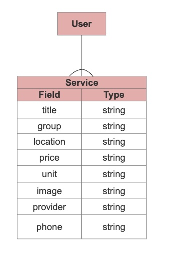

Project Capstone 
- **Project Name:** SaleService
- **Project By:** Haleh Bozorgnia

A full CRUD (Create, Read, Update, Delete) app for people to sell their services to others is a web application that facilitates the exchange of services between individuals or businesses. Such an app would typically include the following components and features:

- **Users can create listings for the services they offer, including:**
Title,Type,Provider, Location,Price,Unit,Image,Phone 
Ability to upload images showcasing the service.
Search and Discovery

### Links
- [LINK TO GITHUB](https://github.com/Haleh-Bozorgnia/Capstone-Project-Frontend)

- [LINK TO DEPLOYED WEBSITE]()
- [LINK TO TRELLO](https://trello.com/invite/b/xWjZrqzw/ATTIb0826fcb35d19928f0b225fca45828da6AF1608C/saleservice)

---
### Technologies  
HTML, TailwindCSS, PSQL, React, Django, TypeScript

### New Technologies   
TypeScript, TailwindCSS

---
## React Routes

| NAME       | PATH               |
| ---------- | ------------------ |
| HOME       | /                  |
| INDEX      | /index             |
| SHOW       | /:id               |
| CREATE     | /create            |
| UPDATE     | /update/:id        |
| DELETE     | /delete/:id        |

## Components
- Header
- Footer
- Customer Review
- About

## Mockup of UI  
   